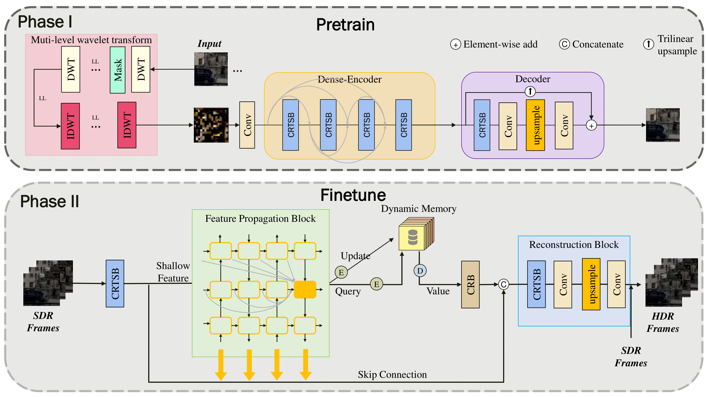
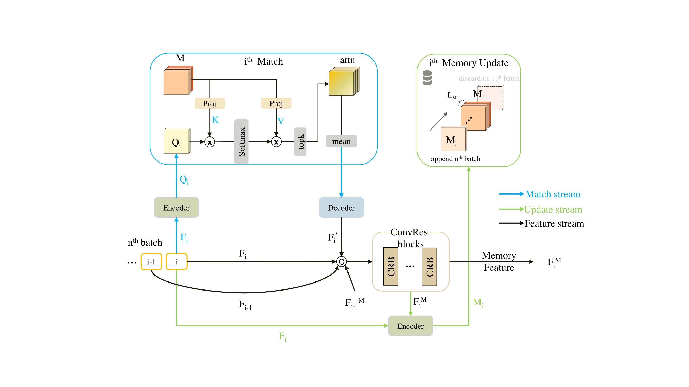

# Overview
High dynamic range (HDR) technology is important for capturing and displaying a wider range of brightness and color in visual media. However, many existing videos are still limited to standard dynamic range (SDR), which can result in inaccuracies in visual representation. To address this issue, we propose a novel single-frame-to-single-frame SDR-to-HDR video reconstruction method in this paper, which can convert SDR videos to HDR format. Our method is based on the masked image modeling (MIM) self-reconstruction principle and extend it to both frequency and spatial domain. In addition, we includes a memory mechanism that can learn from overexposed or underexposed areas in previous frames. This is an important improvement over previous video reconstruction methods, which did not consider using long-term video frames as a memory to gather information. Experimental results show that our approach can effectively enhance the visual quality of SDR videos and achieve competitive performance compared to state-of-the-art methods. In conclusion, our SDR-to-HDR video reconstruction method has great potential for practical applications in the field of HDR video processing and can help improve the visual quality and realism of SDR videos.

_Note that our performance is very close to the state-of-the-art methods and some code cannot be shared publicly due to the ongoing experimentation of the project._

# Framework

# Memory Block

